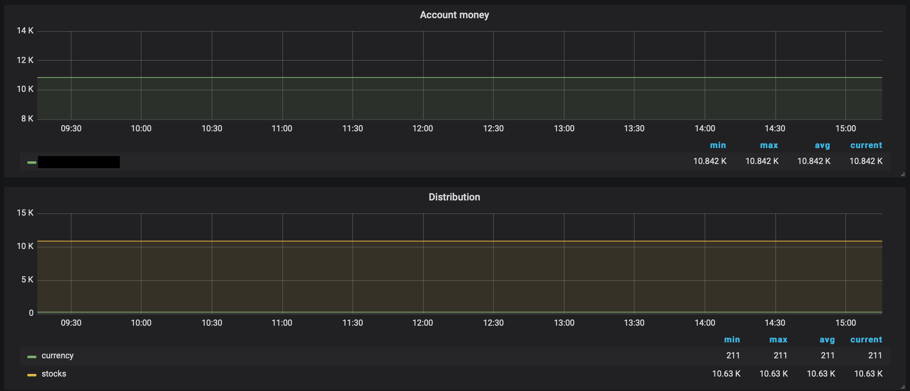

# adirect_exporter

Simple exporter for gather data from Alfa-direct account.
Right now alfa-direct does not give you information across time range about value of your broker account so you can just run this exporter and gather this data in your personal prometheus instance.
As example you can see my chart of account in grafana:

Unfortunetly Alfa is show only one currency - rubbles.

For running exporter you need put a few environment variables:
- LOGIN (from alfa-direct)
- PASSWORD (from alfa-direct)
- TREATY (This is your broker account number)
- ADDRESS (address to listen. 127.0.0.1 as example)
- PORT (port to listen. 8000 or other as you wish)
